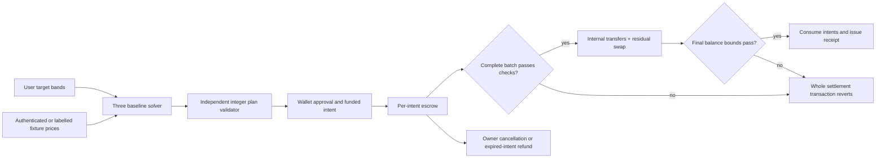

# CrossFlow execution feasibility — Research

**Researched:** 22 September 2026 (IST). **Scope:** planning only; no deployment or integration tested. **Confidence:** MEDIUM for documented capabilities; runtime compatibility and access remain open gates.

## User Constraints

The user selected CrossFlow and requested a detailed execution plan with task acceptance checks, invariant enforcement, and recurring reviews. All value-moving transactions and deployments must use devnet; local validators are permitted for development. No mainnet writes or spending. Main competition is the objective; Pyth is conditional on suitable free access and Meteora DBC is optional. The user and AI agents can supply implementation capacity. These are session decisions, not claims of technical feasibility. No CONTEXT.md was available at research start. [VERIFIED: conversation and workspace inspection]

## Project Constraints (from AGENTS.md)

The supplied project instruction requires CodeGraph before code exploration when a `.codegraph/` directory exists. No such directory or local AGENTS.md was found during this inspection; the supplied instruction still applies if indexing is added. No project skills directory or application source was found at research start. [VERIFIED: local filesystem inspection]

## Summary

Use a small funded-intent escrow protocol with an untrusted off-chain optimizer. Demonstrate three strategy accounts, two stock fixtures and test cash, subject to an early full-transaction capacity spike. Fund/authorize each intent first; settle the selected complete batch atomically, with no partial fills in this release. This is a proposed design, not an implementation claim.

Pyth Pro has a documented Solana devnet deployment. A newly checked official Terminal page advertises a self-service free API trial without a credit card; this supersedes the earlier assumption that Terminal is necessarily view-only. Exact equity permissions and trial lifetime remain unverified. [Source](https://docs.pyth.network/price-feeds/pro/contract-addresses) [Source](https://docs.pyth.network/price-feeds/pro/pyth-terminal)

**Primary recommendation:** prove fair economic advantage and the complete settlement transaction early; make paid data, sponsor scope and unsupported token extensions incapable of blocking the core demo.

## Architectural Responsibility Map

The following allocation is the recommended design, not a description of existing code.

| Capability | Primary owner | Supporting owner | Acceptance boundary |
|---|---|---|---|
| Targets and consent | Browser + user's wallet | Shared schema | Human-readable amounts equal signed raw constraints |
| Three-baseline optimization | Local/backend solver | Deterministic scenario evaluator | Feasible result, bounded runtime, honest benchmark |
| Plan verification | On-chain settlement program | Independent off-chain validator | Never trust solver output or frontend approval flags |
| Custody while awaiting settlement | Per-intent PDA escrow | Owner wallet | Only settlement or owner-directed refund may release assets |
| Price authentication | On-chain oracle adapter | Backend fetcher | Verify signature and feed identity before using value |
| Residual swaps | Allowlisted venue adapter | Quote/simulation service | Explicit programs/accounts, bounded debit and net receipts |
| Evidence | Append-only experiment/deployment artifacts | UI receipts | Label simulation, replay and real devnet distinctly |

## Standard Stack

Use Rust/Anchor for program development and TypeScript for browser, transaction construction and shared fixtures. Keep the optimizer behind a language-neutral JSON schema; select its numerical library only after a tiny model solve and package-legitimacy check. This recommendation avoids locking unverified package versions.

| Observed executable | Local version | Interpretation |
|---|---|---|
| Node | 24.10.0 | Installed, not a proved SDK compatibility choice |
| Anchor CLI | 1.1.2 | Installed; match framework dependencies deliberately |
| Solana CLI | 3.1.10 | Installed; devnet connectivity/faucet untested |
| Cargo | 1.91.1 | Installed; SBF dependency build untested |

[VERIFIED: `node --version`, `anchor --version`, `solana --version`, `cargo --version`]

No external packages were installed or approved in this bounded research. The implementation preflight must discover exact package names through official docs, verify package identities and registry versions/publication dates, inspect licenses and lifecycle scripts, and lock a mutually compatible dependency set. CLI presence is insufficient evidence. Do not upgrade tooling merely because a newer version exists.

## Architecture Patterns



Proposed intent fields: schema version, deployment domain, owner, unique intent ID, expiry, permitted mints/token-program IDs, source escrow and destination accounts, exact maximum debits/minimum net credits, maximum fees, asset-semantics commitment, and approved plan/batch commitment. Store authorization using the wallet-signed funding transaction; avoid adding a second bespoke off-chain signature protocol unless essential. Validate uniqueness of participants, intents, escrows and destinations. Specify any allowed shared accounts separately.

Prefer approval of a concrete integer plan within the user's target bands. Thus the optimizer explores flexibility before approval; the program enforces the accepted result. Do not advertise unattended standing mandates or on-chain proof of global optimality.

One Solana transaction is atomic, including nested program work, but failed transactions can still charge transaction fees. The published baseline packet limit is 1,232 bytes; newer formats and account limits depend on supported runtime features. [Source](https://solana.com/docs/core/transactions) Plan conservatively for legacy/v0 limits; do not depend on newer capacity without a real devnet probe. Capacity gate must include oracle proof, compute-budget instructions, all token accounts, residual venue accounts, signatures, and receipt work. If oversized, first reduce participants/assets; never silently split an advertised atomic batch.

## Pyth Integration Gate

The SVM guide requires an explicit Ed25519 verification instruction and Pyth verifier invocation bound to the exact signed message and instruction offsets. The native Ed25519 program cannot simply be invoked through CPI. Program ID is `pytd2yyk641x7ak7mkaasSJVXh6YYZnC7wTmtgAyxPt` on documented Solana devnet. Verify storage/treasury/program accounts against the current network before use. [Source](https://docs.pyth.network/price-feeds/pro/integrate-as-consumer/svm) [Source](https://docs.pyth.network/price-feeds/pro/contract-addresses)

Proposed gate: obtain the no-card trial through the user's own account, test the exact two equity feed IDs, record entitlement/expiry, retrieve signed payloads, and verify one on devnet. Keep the long-lived key server-side; restrict backend feeds and request rate. Pyth documents per-asset entitlements, expiring demo tokens and removal of the unauthenticated beta proxy. [Source](https://docs.pyth.network/price-feeds/pro/faq)

For settlement validate feed ID, positive price, exponent range, channel/session policy, confidence when required, future timestamp tolerance and underlying observation age. Fresh envelope time is insufficient: carried-forward prices retain an earlier `feedUpdateTimestamp`. [Source](https://docs.pyth.network/price-feeds/pro/payload-reference) Define a numerical max-age policy in the implementation specification, test both sides of its boundary, and reject rather than substitute a fixture in authenticated mode. Keep fixture mode in a separate deployment/configuration domain.

If free suitable equity access cannot be proved in the initial access timebox, use labelled test reference prices for the core and remove the Pyth qualification claim. Never buy access automatically or imply a crypto key proves equity entitlement.

## Token Semantics and Refund Design

Scaled UI Amount changes displayed balances without changing raw token amounts; scheduled multiplier changes and floating-point conversion can prevent exact round trips. [Source](https://solana.com/docs/tokens/extensions/scaled-ui-amount) Settle raw integer quantities only. Bind valuation conversion to a reviewed semantics snapshot; reject multiplier/decimals/token-program/authority-policy changes that invalidate consent. Use checked widened integer arithmetic and documented directional rounding. Show raw and adjusted amounts in receipts when relevant.

Paused Token-2022 mints reject transfers, minting and burning. [Source](https://solana.com/docs/tokens/extensions/pausable) Consequently a refund cannot bypass an issuer pause. Separate cancellation from individual-asset withdrawal: mark an intent cancelled and make available assets independently refundable while retaining blocked-asset claims. Require no oracle, solver, other user or batch completion to authorize a refund. Display issuer-blocked withdrawal honestly and test recovery after unpause.

Launch with an explicit extension allowlist. Unsupported transfer hooks, permanent delegates, transfer fees, confidential transfers or CPI restrictions must reject at admission rather than fail unpredictably after funding. Supporting one Token-2022 extension does not imply supporting all combinations. Token extensions add distinct mint/account state. [Source](https://solana.com/docs/tokens/extensions)

## Optional Meteora DBC

Meteora's official program repository lists devnet `dbcij3LWUppWqq96dh6gJWwBifmcGfLSB5D4DuSMaqN` and SPL/Token-2022 support. DBC is specifically a configurable launch curve. [Source](https://github.com/MeteoraAg/dynamic-bonding-curve) These facts do not establish arbitrary extension support or hackathon eligibility.

Gate the optional adapter on real devnet pool creation, a buy and sell, net balance reconciliation, fees, token compatibility, and a completed atomic CrossFlow batch. Explain why a launch curve contributes to the stock workflow. Keep pool migration outside the required demo; do not depend on a keeper. Cut the integration if it compromises the core schedule. A controlled test AMM is a fallback experiment venue, never a claimed Meteora integration.

## Economic Validation and Stop Gates

The cited cooperative-cost paper models multiple portfolio managers in one firm with different mandates. [Source](https://arxiv.org/html/2603.07881v1) Therefore use one consenting operator with several strategy accounts as the initial product scenario; do not infer anonymous-user incentive compatibility or privacy guarantees.

Proposed required experiment: A = independent cost-aware rebalancing; B = match A's fixed orders and route residuals; C = jointly adjust within the same mandate, then match/route. Freeze identical initial balances, risk/target constraints, valuation snapshot and cost model. Include fixed network costs, spread, nonlinear impact, venue fees and explicit waiting/failed-transaction scenarios. Report per-account cost, total cost, target error, external turnover and feasibility, not only a mean saving.

Require a holdout matrix containing opposed flows, all-buy flows, no-trade optimum, scarce liquidity, large imbalance, tight bands and infeasible requests. C must never manufacture benefit by violating bands or exploiting unequal valuation/fees. A no-trade optimum is valid when the mandate permits it; compare it fairly. Measure incremental C-versus-B advantage separately from B-versus-A. If incremental benefit is negligible after honest costs, stop feature expansion, revise the economic design or narrow the claim. No numerical savings promise is justified yet.

## Don't Hand-Roll

| Problem | Use instead |
|---|---|
| Signature verification | Wallet transaction signatures and official Pyth verification flow |
| Token movement | Checked SPL/Token-2022 instructions with reviewed account constraints |
| Venue pricing | Venue's documented quote/math plus independently measured net balances |
| Convex optimization | Established numerical library selected after license, registry and compatibility checks |
| Decimal authority | Raw-unit schema with one reviewed conversion boundary |

Anchor documents signer, seeds, owner, address and token constraints; duplicate protections vary with account type. Explicitly test remaining-account aliasing instead of assuming macros validate arbitrary arrays. [Source](https://www.anchor-lang.com/docs/references/account-constraints)

## Code Examples

Implementation sketch only; not tested or a substitute for official integration code:

```text
settle(batch):
  validate unique funded, unexpired, uncancelled intents and committed plan
  authenticate configured oracle mode; reject stale/changed asset semantics
  snapshot raw escrow and destination balances
  execute allowlisted internal transfers and bounded residual swap
  reload account balances after every external program interaction
  assert every net debit/credit/fee bound and per-mint conservation
  consume each intent exactly once; retain immutable receipt identifiers
  any failed assertion => transaction error
```

The transaction rollback mechanism is documented by Solana; the above checks are proposed CrossFlow requirements. [Source](https://solana.com/docs/core/transactions)

## Validation Architecture

No application test infrastructure existed at inspection. [VERIFIED: workspace inspection] Define runnable commands in task plans before implementation, then require actual reports, not anticipated pass marks.

| Gate | Required evidence |
|---|---|
| Every task | Requirement IDs, positive/negative cases, diff review, exact commands and exit status |
| Every money-path change | Missing/wrong signer, account substitution, duplicate account, overflow, replay, cancel/settle race, expired intent, altered plan, malicious venue/oracle tests |
| Every schema/amount change | Shared golden vectors in Rust/TypeScript/solver; boundary rounding and maximum values |
| Every merge | Relevant unit suite and deterministic full local settlement/refund regression |
| Before first devnet deployment | Build/version lock, full transaction simulation, network genesis guard, test-only mint registry, key leak check |
| After every deploy | Program/config identities, deposit/settle/refund smoke, failed-batch balance invariance excluding transaction fees |
| Release candidate | Fresh-wallet full workflow, interrupted/retried transaction recovery, hard rejection demo, receipts reconstructed from chain |

## Security Domain

ASVS is a web-application standard, not a smart-contract audit certificate. Its current published 5.0 numbering differs from older GSD templates. [Source](https://owasp.org/projects/asvs) [Source](https://cornucopia.owasp.org/taxonomy/asvs-5.0)

Apply ASVS 5.0 areas V2 validation/business logic, V3 frontend, V4 APIs, V6 authentication, V8 authorization, V11 cryptography, V12 secure communication, V13 configuration, V14 data protection and V16 logging. Add V7/V9 only if session/token services are introduced. Proposed controls: strict payload bounds; untrusted solver treatment; devnet allowlist plus RPC genesis check; canonical intent commitment; server-only API key; escaped UI data; API rate limits; logs without credentials; no arbitrary program dispatch. Account signing establishes authority; connecting a wallet alone does not authorize funding.

## Environment Availability

Installed CLIs are listed above. Context7 MCP and `ctx7` CLI were unavailable; official web documentation was used. RPC access, faucet balance, Pyth credentials, exact stock entitlements, runtime feature activation, venue pools and browser wallet support were not tested. [VERIFIED: tool discovery/local probe; untested status]

Fallbacks: local validator for iteration; labelled fixture oracle for core; controlled test venue for economic demonstrations. No fallback may silently claim equivalent sponsor integration. Devnet evidence remains a release requirement.

## Assumptions Log / Open Questions

| Unproved planning assumption | Resolution before commitment |
|---|---|
| Three accounts/two stocks fit the intended transaction | Full serialized transaction and compute simulation, then devnet proof |
| Trial permits desired equities through submission | Acquire/test exact feeds and record expiry, without payment |
| Existing toolchain fits sponsor dependencies | Minimal locked compatibility build |
| Cooperation beats simple netting enough to matter | Fair, reproducible holdout benchmark |
| Selected fixture extensions work with DBC | Pool/swap/integrated-batch tests; otherwise reject or cut DBC |
| Public research code is reusable under suitable terms | Verify repository license at pinned commit; otherwise implement mathematics independently with attribution |

These are explicit hypotheses, not verified facts. No sponsor eligibility or winnings are guaranteed.

## Sources and verification limits

Primary sources are linked inline. Local observations are labelled VERIFIED; proposed architecture and checks are recommendations. No product integration, package compatibility build or deployment was executed during this research. Recheck feed permissions, SDK compatibility and deployment identities at execution and before release. Capability confidence is medium because runtime feasibility and exact free-data entitlement remain untested.
